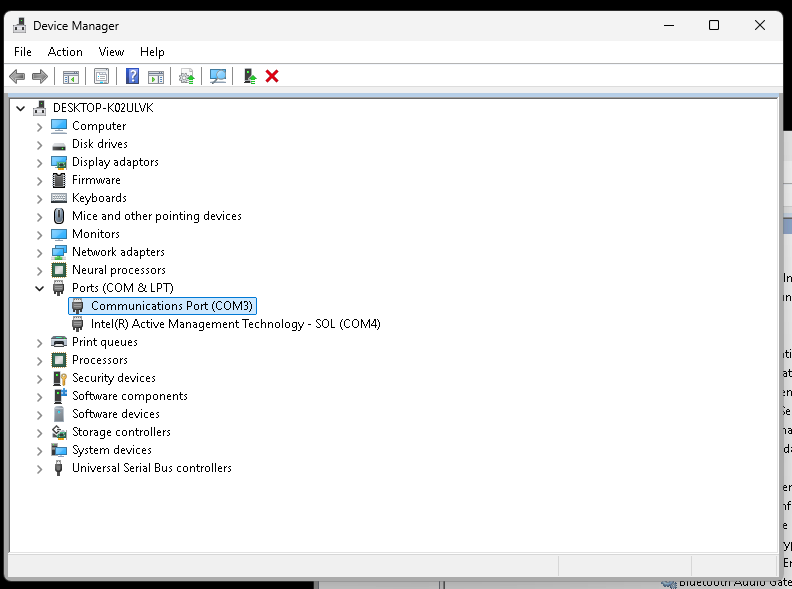
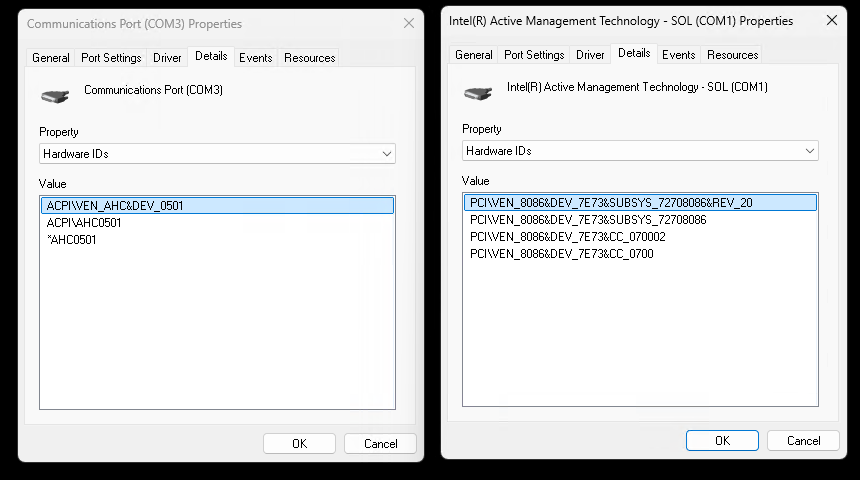
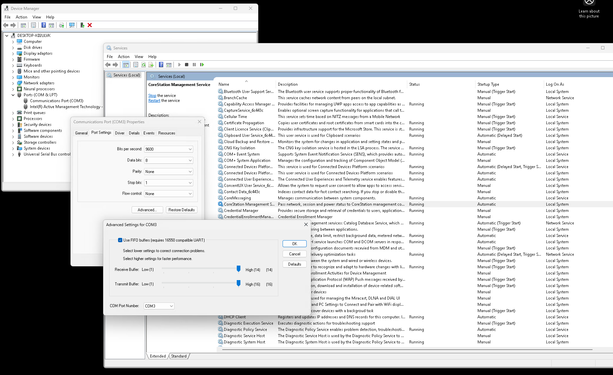

# README #

## Files ##
```
michaels-node-win-app
│   README.md > this file
│   Makefile > Generated by cmake
│   build.bat > Windows Build script - to be updated
│   start.ps1 > Starts the service
│   install_manifest.txt > generated by cmake
│   CMakeLists.txt > CMake Config
│   ps.bat > Sets execution policy to bypass
│   stop.ps1 > Stops the service
│   release-notes.txt > Release notes to go with application
│   CoreStationHXAgent.service > Linux Service file
│
├───installer
│       install.ps1 > Installs the service on a Windows System
│       remove.ps1 > Removes the service from a windows system
│
├───src
│       version.h > Versioning file
│       main.cpp > Main code, runs regardless of platform
│       Platform.h > Initial global definitions of functions
│       WindowsPlatform.cpp > Code specific to Windows
│       LinuxPlatform.cpp > Code Specific to Linux
│       SystemState.h > Framework for Network Interface and System State data
│
└───debian
    │   dh-cmake.compat > dh-cmake rules version
    │   postrm > Post Removal Script
    │   compat > sets debhelper compatibility level
    │   copyright > Sets Copyright Information in the DEB file
    │   rules > minimal debhelper rules
    │   changelog > Changelog for DEB File
    │   clean > Files to remove before debuild builds
    │   prerm > Pre Removal script
    │   control > DEB File Details
    │   postinst > Post Installation script
    └───source
            format > the desired format for the source package 

```

## Linux Build ##
Developed on Ubuntu 24.04.5 LTS due to better compatibility with the Meteor Lake Processor

### User Guide ###

- Ensure the Serial Port that links to the MEC is set to `/dev/ttyS2`
    - It is very likely that this is the case, can be checked by monitoring serial output and sending data to the port:  
    ```bash
    echo "TESTING" > /dev/ttyS2
    ```
- Clone the repo
- cd into the directory
- Install Dependencies  
`sudo apt install build-essential cmake devscripts debhelper dh-cmake libdbus-1-dev network-manager`
    - build-essential and cmake are build dependencies
    - debhelper, dh-cmake and devscripts are dependencies for building the .deb package
    - libdbus-1-dev and network-manager are required for pulling system info
 - Update Information in relevant files:
     - `src/version.h`
     - `debian/control` - Not 100% necessary to be updated
     - `debian/copyright`
     - `debian/changelog` - *100% Necessary to change this*
 - ***NOTE***: If debuild complains about no new lines at end of files, run `echo "" >> <file>` to add a new line to the end
 - in the project root, run:
    ```bash
    debuild -us -uc -S -I
    ```
    to build the source files
 - then run:
   ```bash
   debuild -us -uc -b
   ```
    to build the .deb file, but this will be unsigned
- I think at this point, it could be signed with the existing method for windows executables but I am not sure

### To Install ###
```bash
sudo apt install ./corestationhxagent_2025.9.1-1_amd64.deb
```
following that, the status of the service can be viewed with
```bash
sudo systemctl status CoreStationHXAgent
```
this will show something like:
```
● CoreStationHXAgent.service - CoreStation HX Agent
     Loaded: loaded (/usr/lib/systemd/system/CoreStationHXAgent.service; enabled; preset: enabled)
     Active: active (running) since Wed 2025-09-24 15:14:08 BST; 18h ago
   Main PID: 57599 (CoreStationHXAg)
      Tasks: 3 (limit: 13993)
     Memory: 15.5M ()
     CGroup: /system.slice/CoreStationHXAgent.service
             └─57599 /usr/sbin/CoreStationHXAgent
```

## Windows Build ##
This project was developed on a Win 11 Pro CoreStation Node


### User guide

- Ensure the COM port that links to the BMC MEC is configured as **COM3**. This should be the default for the Congatec COM but will need modifying for
 the Advantec deveopment units.
 
- On both Congatec and Advantect units COM3 should have a Device ID of `ACPI\PNP0501\21`, 
- Be careful **not** to select the `Intel(r) Active Management Technology SOL` (AMT/vPRO) COM port which is normally COM4 (Has Now been disabled via the BIOS)

- You can change the COM port via **Device Manager > Ports > Right Click > Properties > Port Settings > Advanced > COM Port Number
- **NOTE** You must restart the machine after changing the COM ports

- The `./build.sh` script will push RC and GA to [ahkengbuild](http://ahkengbuild/versions) 
- Run `install.ps1` from a Administrator powershell terminat. This script will remove any previous version, install and then run the service 
- The service will appear as `CoreStation Management Service` in the Windows Service Manager
- You can use the `remove.ps1` powershell script to remove the service


### Debug output
Unless the build version is a GA, all output to the serial port will also be stored in `C:\ProgramData\ahk\node-win-app.log` via `LogMessage(<string>);`

### Tray helper (interactive mode)
- When the app runs interactively (StartServiceCtrlDispatcher fails), a tray icon is created using the Windows notification area.
- The tray tooltip is fed by a named pipe at `\\.\pipe\corestation_tray`.
- Send plain text lines containing `hostname=`, `ip=` (or `ipaddress=`), and `uptime=`. Example payload:
  ```text
  hostname=NODE-01
  ip=192.168.1.10
  uptime=2d 04h 13m 09s
  ```
- A quick PowerShell sender for testing:
  ```powershell
  $pipe = New-Object System.IO.Pipes.NamedPipeClientStream('.', 'corestation_tray', [System.IO.Pipes.PipeDirection]::Out)
  $pipe.Connect(1000)
  $writer = New-Object System.IO.StreamWriter($pipe)
  $writer.AutoFlush = $true
  $writer.WriteLine('hostname=NODE-01')
  $writer.WriteLine('ip=192.168.1.10')
  $writer.WriteLine('uptime=2d 04h 13m 09s')
  $writer.Dispose(); $pipe.Dispose()
  ```
- Tooltip format: `Host: <hostname> | IP: <ip> | Up: <uptime>`.


### To build
- Update `version.h` with the desired release details **and COM port** and commit to git
- Run `build.bat` from windows **cmd shell**. This will populate the installer dir that can then be passed to a third party
- As admin from **PowerShell shell** run `installer/install.ps1` to setup as windows service. This will automatically stop and remove any previous versions before instalation 
- `remove.ps1` can be used to remove the service


### Build machine setup #
- Install VSCode: [download](https://code.visualstudio.com/download) and pin to task bar
- Install Cmake [4.0.0 Windows x64 Installer](https://cmake.org/download/) add to PATH
- Install MSVC Microsoft Studio Compiler [Build Tools](https://visualstudio.microsoft.com/visual-cpp-build-tools/) Select Desktop development with C++ and ensure the following are checked:
  - MSVC v143 - VS 2022 C++ x64/x86 build tools
  - Windows 11 SDK (10.0.xxxxx.x)
  - C++ CMake tools for Windows 
- Create a `build` directory
- Open VScode
- `Ctrl+Shift+P`
- `CMake: Scan for Kits`
- `CMake: Select a Kit`
- `CMake: Configure`
- Install [clang-tidy](https://github.com/openblack/openblack/wiki/Getting-clang%E2%80%90tidy-working-on-Windows-with-VSCode) C++ linter
  - See https://llvm.org/ for documentation
  - Download & install as admin latest [LLVM-20.x.x-win64.exe](https://github.com/llvm/llvm-project/releases) **NOTE**: You might need to go back a version to find the windows installer Asset as they update every couple of weeks
  - Windows will moan about an unsigned app, accept and install
  - Add LLVM to system path for all users
  - Will be installed to `C:\Program Files\LLVM`
  - Reboot dev machine (to sort out paths etc)
  - Check it works via `clang-tidy --version`

To allow cl.exe and dumpbin to work from the command line, `C:\Users\labtest\AppData\Roaming\Code\User\settings.json` should read as follows
```json
    {
      "git.confirmSync": false,
      "terminal.integrated.profiles.windows": {
      "Developer Command Prompt": {
          "path": "C:\\Windows\\System32\\cmd.exe",
          "args": [
              "/k",
              "C:\\Program Files (x86)\\Microsoft Visual Studio\\2022\\BuildTools\\VC\\Auxiliary\\Build\\vcvars64.bat"
          ]
      },   

          "PowerShell": {
              "source": "PowerShell",
              "icon": "terminal-powershell"
          },
          "Command Prompt": {
              "path": [
                  "${env:windir}\\Sysnative\\cmd.exe",
                  "${env:windir}\\System32\\cmd.exe"
              ],
              "args": [],
              "icon": "terminal-cmd"
          },
          "Git Bash": {
              "source": "Git Bash"
          }
      },
      "terminal.integrated.defaultProfile.windows": "Developer Command Prompt"        
    }
```


### Day to Day use
- To build open main.cpp and press `F7` (or `Ctrl+Shift+P` > `CMake: Build`)
- Clang current file `Ctrl+Shift+P` > `Tasks: Run Task` > `Run Clang Tidy (Current File)`, Issues will be listed in PROBLEMS tab at bottom and 
- To transfer exe to another machine from Win11 console
  ```bat
  cd  C:\Users\labtest\repos\node-win-app\build
  scp *.exe user@node-jm:~
  ```

  Build for release via
    ```bat
    cl.exe /O2 /DNDEBUG /EHsc /MT /nologo /FeC:\Users\labtest\repos\node-win-app\main_release.exe C:\Users\labtest\repos\node-win-app\main.cpp /link user32.lib gdi32.lib shell32.lib advapi32.lib comctl32.lib winmm.lib Wtsapi32.lib
  main.cpp
    ```


### How to sign and exe
- Need 
   - A Extended Validation (EV) Code Signing Certificate (Cloud, USB dongle or Hardware Security Module)
   - AHK purhased a [Code Signing EV + Keylocker](https://docs.digicert.com/en/digicert-keylocker.html) annual subscription from digicert.com Apr 25 for £804
   - signtool from Windows SDK / MSVC tools above
DigiCert offer EV on USB Token £708 /year or Cloud based KeyLocker for £804
- Sign into digiCert [account](https://accounts.digicert.com/) (DaveG/MattA/IT are admins)
- [General Signer guide](https://docs.digicert.com/en/digicert-keylocker/get-started/signer-guide.html)
- [Code Signing guide](https://docs.digicert.com/en/digicert-keylocker/code-signing/sign-with-digicert-signing-tools.html)

 

### Working with services
- Run `services.msc` from windows search bar
- To register a window service (one-time) open an admin cmd window
` sc.exe create CoreStationService  binPath= "C:\Users\labtest\repos\node-win-app\build\NodeWinApp.exe" start= demand  displayname= "CoreStation Service AHK`
  ```powershell
  PS C:\Users\labtest> sc.exe create CoreStationService  binPath= "C:\Users\labtest\repos\node-win-app\build\NodeWinApp.exe" start= demand  displayname= "AHK CoreStation Service"
  [SC] CreateService SUCCESS
  ```
- Start can be `auto` or `demand`
- Can change with `sc.exe config CoreStationService start= auto`
- `start.ps1` and `stop.ps1` helper scripts will open a admin shell and start or stop the service
- `ps.bat` will open a admin powershell window and attempt to run the start.ps1 script. Window will remain open 
- Start sevice `sc.exe start CoreStationService`
  ```powershell
  PS C:\Users\labtest> sc.exe start CoreStationService

  SERVICE_NAME: CoreStationService
        TYPE               : 10  WIN32_OWN_PROCESS
        STATE              : 4  RUNNING
                                (STOPPABLE, NOT_PAUSABLE, IGNORES_SHUTDOWN)
        WIN32_EXIT_CODE    : 0  (0x0)
        SERVICE_EXIT_CODE  : 0  (0x0)
        CHECKPOINT         : 0x0
        WAIT_HINT          : 0x0
        PID                : 6640
        FLAGS              :
  ```

  - You can check current status with  `sc.exe query CoreStationService`


### PowerShell Execution policies
 PowerShell has several execution policy levels 
 You can find the current level via `Get-ExecutionPolicy -List` and change it for current session (if admin) via `Set-ExecutionPolicy Bypass -Scope Process`
 
| Policy       | Description                                                                          |
|--------------|--------------------------------------------------------------------------------------|
| Restricted   | ❌ Default on Windows: No scripts can run. Only interactive commands allowed.         |
| AllSigned    | ✅ Only scripts signed by a trusted publisher can run (including local ones).         |
| RemoteSigned | ✅ Local scripts can run freely, but downloaded ones must be signed.                  |
| Unrestricted | ⚠️ All scripts can run. Warns before running downloaded scripts.                      |
| Bypass       | 🟢 No restrictions, no warnings. Used for automation or temporary installs.           |
| Undefined    | 🚫 No policy set at that scope. Inherits from higher scope or defaults to Restricted. |

### Lint-ing
Research with chatGPT concluded that [*clang_tidy*](https://learn.microsoft.com/en-us/cpp/code-quality/clang-tidy?view=msvc-170) was best lint-er for this kind of project 

How to set up clang-tidy with CMake (MSVC or Clang toolchain):
- Configure your CMake project with compile commands:
`cmake -B build -DCMAKE_EXPORT_COMPILE_COMMANDS=ON`
which generates compile_commands.json, which clang-tidy uses to understand how each file is compiled.

- Run clang-tidy manually:
`clang-tidy src/main.cpp -- -Iinclude`
- Or use the helper script to run clang-tidy on all source files:
`run-clang-tidy.py -p build/`
- VSCode Integration: Install the extension: *C++ Advanced Lint* or just configure clang-tidy via c_cpp_properties.json.

To enable pre-commit checks I created this file 
  ```bash
  #!/bin/bash

  echo "🔍 Running clang-tidy on main.cpp..."

  SRC="main.cpp"
  CLANG_FLAGS="-std=c++17 -Iinclude"

  if [ -f "$SRC" ]; then
    clang-tidy "$SRC" -- $CLANG_FLAGS
    if [ $? -ne 0 ]; then
      echo "❌ clang-tidy failed. Commit aborted."
      exit 1
    else
      echo "✅ clang-tidy passed."
    fi
  else
    echo "⚠️ File '$SRC' not found. Skipping."
  fi
  ```


### Future development 

The first release is a windows service that can't have a GUI / tray icon etc. If this is required later, we
will need to create a seperate Tray helper app that starts after a user logs in, shows a tray icon that can 
be interacted with. Communciation between the two could be via Named Pies, Shared memroy, local sockets and/or
Windows Messages via services hidden windows handle.

The first development version of this (See tag 2025.4.1-adhoc1) was a pure tray app


### Session state defines
Session state are defined in WinUser.h `C:\Program Files (x86)\Windows Kits\10\Include\10.0.22621.0\um`
  ```c
              APP_STARTING                       0
      #define WTS_CONSOLE_CONNECT                1
      #define WTS_CONSOLE_DISCONNECT             2
      #define WTS_REMOTE_CONNECT                 3
      #define WTS_REMOTE_DISCONNECT              4
      #define WTS_SESSION_LOGON                  5
      #define WTS_SESSION_LOGOFF                 6
      #define WTS_SESSION_LOCK                   7
      #define WTS_SESSION_UNLOCK                 8
      #define WTS_SESSION_REMOTE_CONTROL         9
      #define WTS_SESSION_CREATE                 10
      #define WTS_SESSION_TERMINATE              11   
  ```

### Serial output

#### System power up 
If user previously powered down from a session, both network cables connected
  ```raw
  appVersion, 2025.4.2.rc2
  winVersion, 10.0.26100 Build 26100
  sessionState, 0
  network, 74:fe:48:a3:fe:8d, up, 192.168.203.86, fe80::1451:e373:4c26:e165, dhcp, Ethernet
  network, 00:17:fd:60:02:e1, up, 192.168.203.82, fe80::98d7:656:a39:8ad3, dhcp, Ethernet 2
  username, labtest
  hostname, NODE-30042-0023
  ```

#### Log in
  ```raw
  sessionState, 5
  username, labtest
  ```

#### Lock windows session
  ```raw
  sessionState, 7
  ```    

#### Unlock session
  ```raw
  sessionState, 8
  ```

#### Power down from log in screen
The network changes come several seconds later just before power off, note static ip
  ```raw
  sessionState, 11
  username, none
  network, 74:fe:48:a3:fe:8d, up, 192.168.203.52, fe80::1451:e373:4c26:e165, static, Ethernet
  network, 00:17:fd:60:02:e1, up, 192.168.203.51, fe80::98d7:656:a39:8ad3,  static,  Ethernet 2
  ```  
